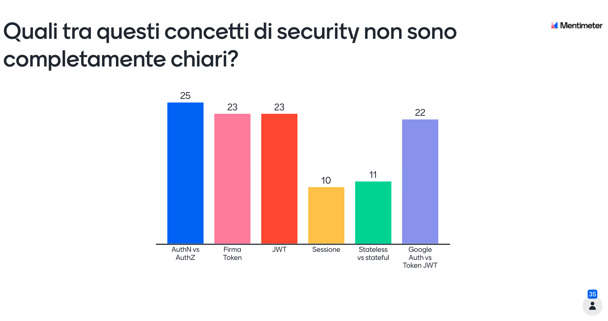

# **GitHub Actions - Google Login - Local Storage**

Software Engineering, 2nd part - Lab

#### Marco Robol - marco.robol@unitn.it

*Academic year 2021/2022 - Second semester*

---

# GitHub Actions

**Automate your workflow from idea to production** - GitHub Actions makes it easy to automate all your software workflows, now with world-class CI/CD. Build, test, and deploy your code right from GitHub. Make code reviews, branch management, and issue triaging work the way you want.

---

# Workflows

- **Node.js CI** - This workflow will do a clean installation of node dependencies, cache/restore them, build the source code and run tests across different versions of node - https://help.github.com/actions/language-and-framework-guides/using-nodejs-with-github-actions

...if build succeed, we want to deploy to Heroku...

- **Deploy to Heroku** - A very simple GitHub action that allows you to deploy to Heroku - https://github.com/marketplace/actions/deploy-to-heroku
  > Pipeline to test and deploy on Heroku - https://medium.com/@katestudwell/using-github-actions-to-create-a-simple-test-and-release-pipeline-for-phoenix-app-d0d65feed4ed

---

## Node.js CI Workflow

`EasyLib/.github/workflows/node.js.yml`
```yaml
name: Node.js CI
on:
  push:
    branches: [ master ]
jobs:
  test:
    runs-on: ubuntu-latest
    strategy:
      matrix:
        node-version: [14.x]
    steps:
    - uses: actions/checkout@v3
    - name: Use Node.js ${{ matrix.node-version }}
      uses: actions/setup-node@v3
      with:
        node-version: ${{ matrix.node-version }}
        cache: 'npm'
    - run: npm ci #similar to npm install , except it's meant to be used in automated environments
    - run: npm run build --if-present
    - run: npm test
```

---

## Environment variables

`EasyLib/.github/workflows/node.js.yml`
```yaml
name: Node.js CI

    # This is used to load Environment-level secrets, from the specified environment.
    # Instead, repository secrets are loaded by default.
    environment: production
    
    env:
      SUPER_SECRET: ${{ secrets.SUPER_SECRET }} # Must be set as a GitHub secret
      DB_URL: ${{ secrets.DB_URL }} # Must be set as a GitHub secret
...
```

---

## Deploy to Heroku

`EasyLib/.github/workflows/node.js.yml`
```yaml
...
jobs:
  test:
    ...  
  release:
    runs-on: ubuntu-latest
    needs: test
    steps:
    - uses: actions/checkout@v2
    - uses: akhileshns/heroku-deploy@v3.12.12
    # https://github.com/marketplace/actions/deploy-to-heroku#procfile-passing
      with:
        heroku_api_key: ${{secrets.HEROKU_API_KEY}}
        heroku_app_name: "your-heroku-app-name"
        heroku_email: "your-email@mail.it"
```

---



---

# Google Authentication
## vs.
# Stateless Authentication for RESTful APIs

Using **Passport** to *Sign In With Google* and **JWT** to sign and verify token and allows for stateless

---

# Cookies vs. localStorage and sessionStorage

> Rispetto ai cookies, gli oggetti web storage non vengono inviati al server con ogni richiesta - https://it.javascript.info/localstorage

```javascript
localStorage.setItem('test', 1);
alert( localStorage.getItem('test') ); // 1
```

---

# Questions?

marco.robol@unitn.it